# birds.eye

**A shared daily journal for two people — where what you write stays hidden until you both do.**

Every day, each person captures something that reminded them of the other — a photo, a thought, a voice memo, a song, a place, a sketch. Whatever it is, it stays completely private the moment it's submitted. The other person can't see it, can't peek, can't know what's coming.

When both people have submitted for the day, everything reveals at once — a simultaneous moment of "here's what I was thinking about you." If one person wants to see the other's entry before submitting their own, they can tap "Reveal Anyway" and unlock it early (at the cost of the surprise).

Every reveal becomes a permanent card in a shared timeline — a growing record of the small things you noticed, the songs that made you think of them, the places you went, the words you almost didn't write. Over time it becomes a journal of your relationship, authored by both of you, one day at a time.

The app is private by design: no public profiles, no followers, no discovery. Just two people and their timeline.

---

## Preview

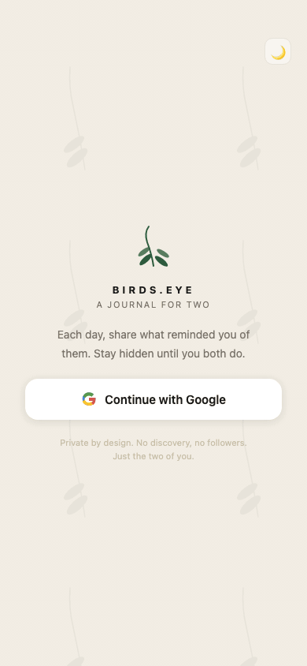

*Landing → onboarding → submit → waiting → reveal → timeline (polaroid + journal + masonry) → dark mode → stats*

---

## Screenshots

<table>
  <tr>
    <td align="center"><b>Timeline — polaroid + journal + date nav</b></td>
    <td align="center"><b>Timeline — polaroid lightbox</b></td>
    <td align="center"><b>Timeline — dark mode</b></td>
  </tr>
  <tr>
    <td></td>
    <td>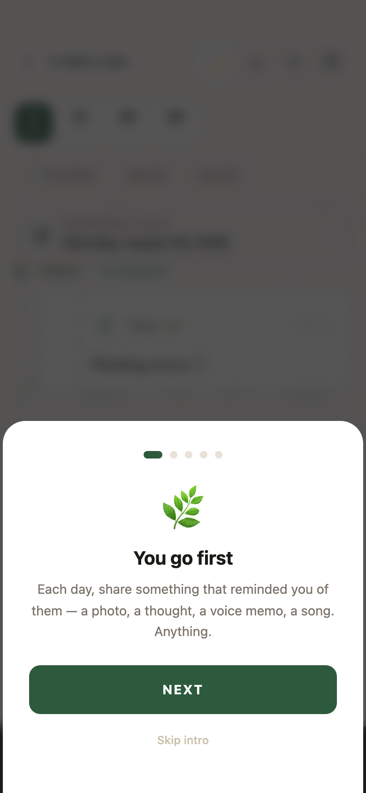</td>
    <td>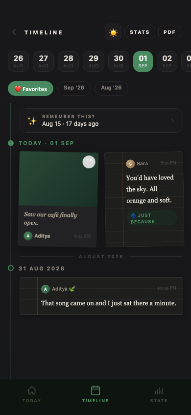</td>
  </tr>
  <tr>
    <td align="center"><b>Home — light</b></td>
    <td align="center"><b>Home — dark</b></td>
    <td align="center"><b>Landing — dark</b></td>
  </tr>
  <tr>
    <td>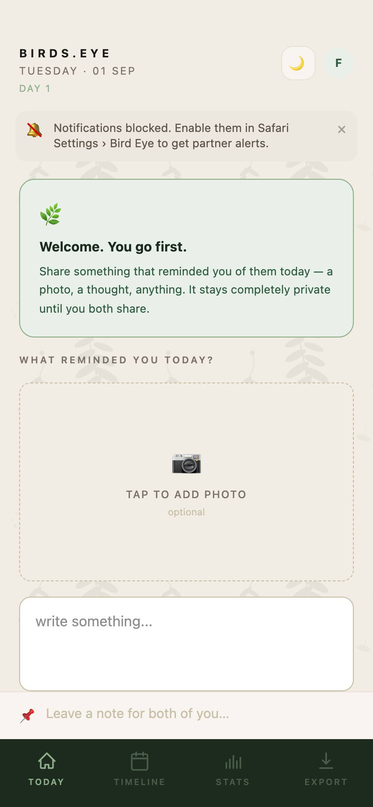</td>
    <td>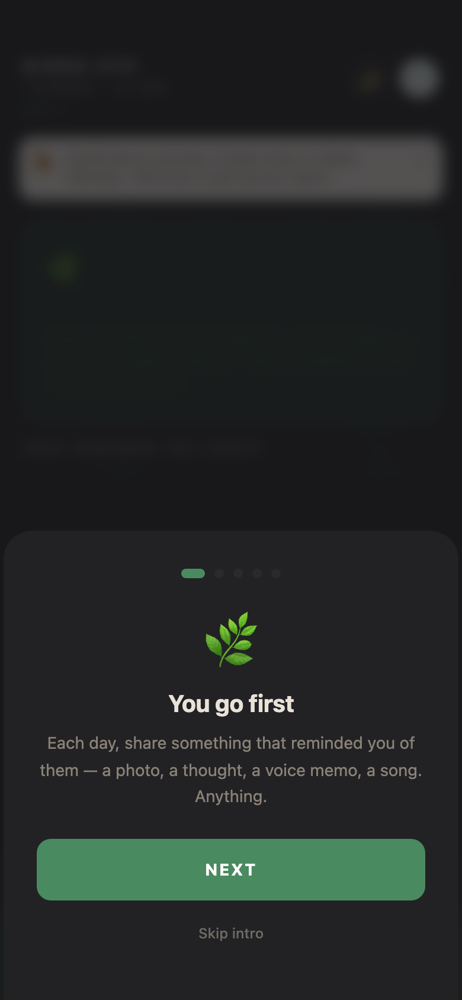</td>
    <td>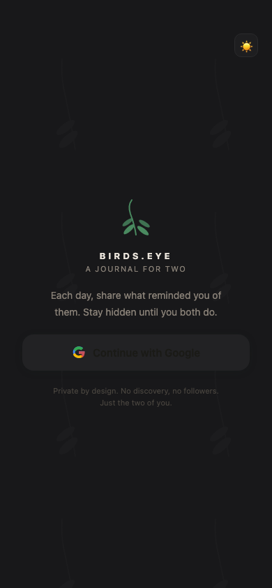</td>
  </tr>
  <tr>
    <td align="center"><b>Waiting for partner</b></td>
    <td align="center"><b>Revealed</b></td>
    <td align="center"><b>Stats page</b></td>
  </tr>
  <tr>
    <td>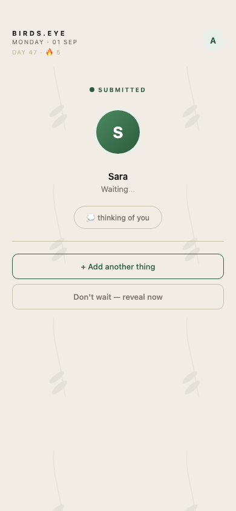</td>
    <td>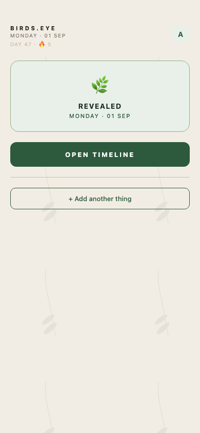</td>
    <td>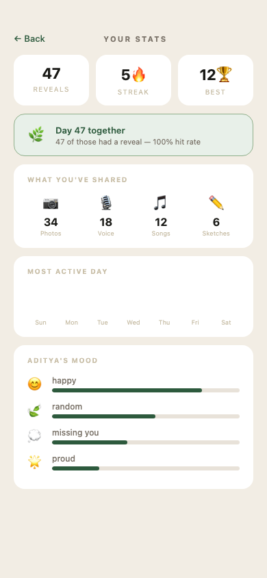</td>
  </tr>
  <tr>
    <td align="center"><b>Pair setup</b></td>
    <td align="center"><b>Onboarding</b></td>
    <td align="center"><b>PDF export</b></td>
  </tr>
  <tr>
    <td></td>
    <td>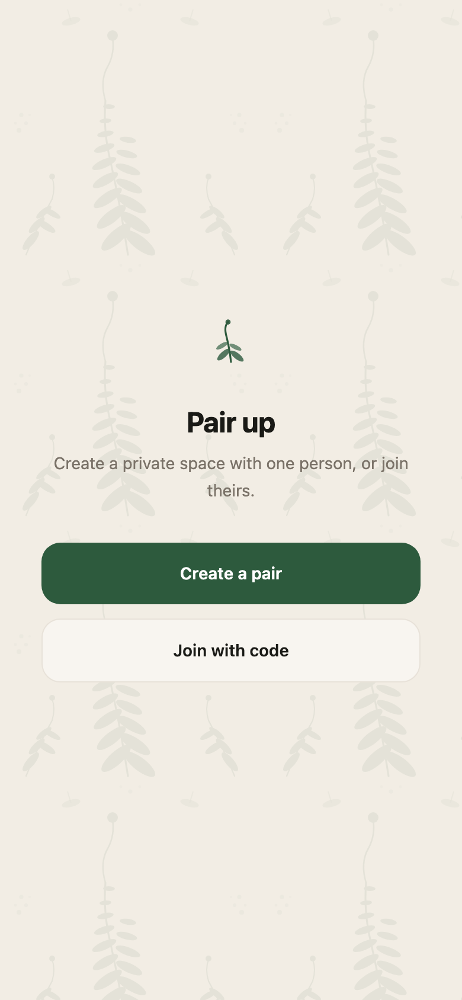</td>
    <td>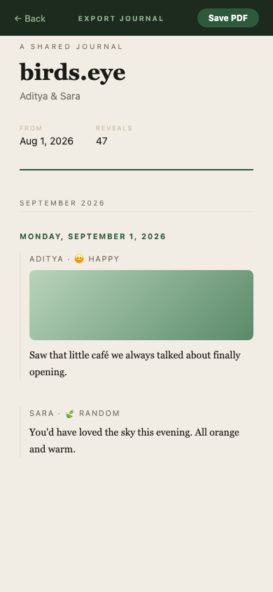</td>
  </tr>
</table>

---

## Features

### Daily submission
Each day, open the app and share whatever reminded you of the other person. You can combine:
- **Text** — write as much or as little as you want, with a rotating daily prompt to get you started
- **Photos** — pick from your camera roll or take one directly; multiple photos per submission
- **Voice memo** — record a voice note; plays back with a custom waveform visualiser
- **Song** — paste a Spotify link; embeds an in-app playback card
- **Location** — share where you are; shows a map tile with a Google Maps link
- **Sketch** — draw something freehand on a canvas; tap the sketch in the timeline to zoom it
- **Mood** — tag the feeling: happy, missing you, proud, or random
- **Tags** — optional context chips: 🧳 trip · 💔 hard day · 🎉 milestone · 🌀 just because · 🎂 birthday

Submissions auto-save as a **draft** (text, mood, and tags persist in local storage). If you close the app mid-way and come back, your draft is waiting.

You can resubmit any day to update or add to what you've already shared.

### Privacy and reveal
- Your entry is invisible to your partner until both of you have submitted — enforced by Firestore security rules, not just the UI
- Once both submit, entries reveal automatically; both devices get a push notification and a confetti animation plays
- Either person can tap **Reveal Anyway** to unlock early (available on the home screen and from the blurred partner tile in the timeline)
- The app home screen icon shows a **badge** when your partner has submitted and you haven't — even when the app is closed

### Onboarding
- First-time pairs see a 3-step bottom sheet explaining the mechanic: you go first → it stays hidden → both reveal at once
- Shown once per device, dismissible at any step

### Shared timeline
- Vertical journal layout: timeline rail, filled/outlined date dots, photo-first editorial cards, month section headers
- Partner's unrevealed tile appears blurred — tap anywhere on it to reveal early
- Switch to **Calendar** view to jump to any specific date
- **Search** — tap the search icon to filter entries by date or month name
- **Flashback** — a "Remember this?" banner surfaces a random past entry each day; tap to scroll to it

### Favourites
- Tap the ❤ corner badge on any submission card to favourite it (stored per-user, not shared)
- Filter the timeline to favourited entries only via the Favourites chip

### Relationship stats (`/stats`)
Computed client-side from all revealed entries:
- Total reveals, current streak 🔥, best streak 🏆
- Days together and reveal hit rate (% of days with a mutual reveal)
- Breakdown of what you've shared: photos, voice memos, songs, sketches
- Day-of-week bar chart — which day you reveal most
- Mood breakdown per person with progress bars
- Timeline span: first and most recent reveal

### On This Day
- A banner surfaces at the top of the timeline if there are revealed entries from the same calendar date in a previous year

### Reactions
- On any revealed entry, tap an emoji to react (❤️ 😂 😢 🌿 ✨); your partner sees it in real time

### Ping
- Send a quick "thinking of you" notification with no content — appears as a floating bubble animation on their screen

### Streak and milestones
- Consecutive-reveal streak shown on the home screen (🔥 fires at ≥ 2 days)
- Milestone push notifications at 1, 7, 10, 30, 50, 100, 200, and 365 reveals — sent once per threshold, never repeated

### Push notifications
- Submissions, reveals, pings, daily reminders, weekly summaries, monthly summaries, and yearly summaries all trigger FCM push notifications
- Set a daily reminder time in account settings; the app nudges you if you haven't submitted by that hour

### Scheduled summaries
| Cadence | Fires | What it says |
|---|---|---|
| Weekly | Every Monday 09:00 UTC | Reveal count for the past 7 days |
| Monthly | 1st of month 09:00 UTC | Reveal count for the previous calendar month |
| Yearly | 1 Jan 10:00 UTC | Reveal count for the previous calendar year |

### Export
- Generate a print-ready PDF of all revealed entries, grouped by month, with photos, text, audio notation, and song links

### Entry deletion
- Request to delete a revealed entry; your partner must consent before it is permanently removed from Firestore and Storage

### Pair management
- Create a pair and share the 6-character invite code (expires in 24 hours)
- Leave a pair at any time from account settings; both users return to pair setup

---

## How to Use

### Getting started
1. Open the app and sign in with Google
2. One person taps **Create a pair** and shares the 6-character code
3. The other person taps **Join with code**, enters the code
4. Both land on the home screen; the onboarding overlay explains the mechanic on first visit

### Submitting your daily entry
1. Open the app on any day — your draft from earlier (if any) is already in the text box
2. Write something, add a photo, record a voice memo, pin your location, paste a Spotify link, or draw
3. Pick a mood and/or tags if you want
4. Tap **Share** — your entry is saved and completely hidden from your partner

### Seeing each other's entries
- If your partner submitted first: their tile is blurred on the home screen. Submit to reveal both, or tap **Reveal Anyway**
- If you submitted first: a waiting screen shows with a progress ring around your partner's avatar. The entries reveal the moment they submit — no refresh needed
- The app badge on your home screen icon lights up when they've submitted and you haven't

### Browsing the timeline
1. Tap **Timeline** in the bottom nav
2. Scroll the journal — each day shows photo-first cards, timestamps, mood, and tags
3. Tap any photo or sketch to open the lightbox (pinch to zoom on mobile)
4. Tap ❤ on a card to favourite it; tap the Favourites chip at the top to filter
5. Tap the 🔍 search icon to find entries by date or month
6. The "Remember this?" banner at the top links to a random past entry
7. Switch to **Calendar** view to jump to a specific date

### Checking your stats
1. Tap **Stats** in the timeline's bottom nav or header button
2. See total reveals, streaks, media counts, most active day, and mood breakdown

### Exporting your journal
1. Tap **PDF** in the timeline header
2. The app compiles all revealed entries and triggers the print dialog automatically

---

A private PWA for exactly two people. Each person independently submits something — a photo, text, voice memo, sketch, song, or location — that reminded them of the other person that day. Their submission stays private until both have submitted (auto-reveal) or one person triggers "Reveal Anyway." Revealed entries form a permanent shared timeline they can browse together.

**Core principle:** Submission privacy is enforced at the Firestore security-rules layer — neither person can read the other's entry until the reveal condition is satisfied, regardless of frontend state.

---

## Table of Contents

1. [Screenshots](#screenshots)
2. [Features](#features)
3. [How to Use](#how-to-use)
4. [Tech Stack](#tech-stack)
2. [Project Structure](#project-structure)
3. [Local Setup](#local-setup)
4. [Environment Variables](#environment-variables)
5. [Available Scripts](#available-scripts)
6. [Firebase Project Setup](#firebase-project-setup)
7. [Cloud Functions](#cloud-functions)
8. [Frontend Pages](#frontend-pages)
9. [Hooks](#hooks)
10. [Services (Client SDK)](#services-client-sdk)
11. [Components](#components)
12. [Data Model](#data-model)
13. [Security Rules](#security-rules)
14. [Deploy](#deploy)

---

## Tech Stack

| Layer | Technology | Version |
|---|---|---|
| UI Framework | React | 19.x |
| Build Tool | Vite | 6.x |
| Language | TypeScript | 5.5+ |
| Styling | Tailwind CSS v4 + `@tailwindcss/vite` | 4.x |
| Routing | React Router | 7.x |
| PWA | vite-plugin-pwa | 1.3.0 |
| Firebase SDK | firebase (modular) | 12.18.0 |
| Cloud Functions | Firebase Functions v2 | — |
| Validation | Zod | 4.x |
| Package manager | npm | — |
| Unit tests | Vitest + React Testing Library | — |
| E2E tests | Playwright + Firebase Emulator | — |

---

## Project Structure

```
bird-catcher/
└── shared-reveal/          # Main app workspace
    ├── src/
    │   ├── pages/          # Route-level components
    │   ├── components/     # Shared UI components
    │   ├── hooks/          # React custom hooks
    │   ├── services/       # Firebase SDK wrappers (client-side)
    │   ├── firebase/       # Firebase app + config init
    │   ├── styles/         # Global CSS (Tailwind v4 config + keyframes)
    │   └── types/          # Shared TypeScript interfaces (Firestore shapes)
    ├── functions/          # Firebase Cloud Functions (Node 22)
    │   └── src/index.ts    # All Cloud Functions defined here
    ├── firestore.rules     # Firestore security rules
    ├── firestore.indexes.json
    ├── storage.rules       # Storage security rules
    ├── firebase.json       # Firebase deploy config
    └── .env.local          # Local env vars (not committed)
```

---

## Local Setup

### Prerequisites

- Node.js 22+
- npm 9+
- Firebase CLI: `npm install -g firebase-tools`
- A Firebase project (Blaze plan required for Cloud Functions)

### Install

```bash
cd shared-reveal
npm install
cd functions && npm install && cd ..
```

### Run with Firebase Emulators (recommended for dev)

```bash
# Terminal 1 — start emulators
firebase emulators:start

# Terminal 2 — start Vite dev server (points to emulators via .env.local)
npm run dev
```

The app connects to local emulators when `VITE_FIRESTORE_EMULATOR_HOST` and `VITE_FIREBASE_AUTH_EMULATOR_HOST` are set (see `.env.local` below).

---

## Environment Variables

Create `shared-reveal/.env.local`:

```env
VITE_FIREBASE_API_KEY=...
VITE_FIREBASE_AUTH_DOMAIN=...
VITE_FIREBASE_PROJECT_ID=birds-eye-c09ff
VITE_FIREBASE_STORAGE_BUCKET=...
VITE_FIREBASE_MESSAGING_SENDER_ID=...
VITE_FIREBASE_APP_ID=...
VITE_FIREBASE_MEASUREMENT_ID=...
VITE_FIREBASE_VAPID_KEY=...

# Leave blank in production build. Set to host:port to route SDK to local emulators.
VITE_FIRESTORE_EMULATOR_HOST=
VITE_FIREBASE_AUTH_EMULATOR_HOST=
```

All values come from Firebase Console → Project Settings → Your apps.

---

## Available Scripts

Run from `shared-reveal/`:

| Script | Description |
|---|---|
| `npm run dev` | Start Vite dev server (connects to emulators if env vars set) |
| `npm run build` | TypeScript check + Vite production build |
| `npm run build:prod` | Same but clears emulator env vars (forces production Firebase) |
| `npm run preview` | Preview the production build locally |
| `npm run lint` | TypeScript type-check only (`tsc --noEmit`) |
| `npm test` | Run all Vitest unit tests |
| `npm run test:rules` | Run Firestore security-rules tests via Vitest + emulator |
| `npm run test:e2e` | Run Playwright E2E tests (requires emulators running) |

---

## Firebase Project Setup

1. Create a project at [Firebase Console](https://console.firebase.google.com)
2. Enable **Authentication** → Google Sign-In provider
3. Enable **Firestore Database** (production mode)
4. Enable **Storage**
5. Enable **Cloud Messaging** (for push notifications)
6. Set up **Hosting** with site name matching `.firebaserc`
7. Enable **Functions** (requires Blaze plan)
8. Set your custom `authDomain` in Firebase Auth settings to avoid Safari redirect issues

Deploy rules, indexes, and functions:

```bash
firebase deploy --only firestore:rules,firestore:indexes,storage,functions,hosting
```

---

## Cloud Functions

All functions are defined in `functions/src/index.ts` and deployed as **Cloud Functions v2** (us-central1).

### `createUserDoc` — Auth trigger

**Trigger:** `user().onCreate`  
**Purpose:** Creates the initial `users/{uid}` document in Firestore when a new user signs in for the first time.  
**Sets:** `displayName`, `email`, `photoURL`, `pairId: null`, `fcmToken: null`, `lastDissolvedAt: null`, timestamps.

---

### `createPair` — Callable

**Called by:** `PairSetupPage` → "Create a pair"  
**Input:** none  
**What it does:**
- Generates a random 6-character hex invite code (uppercase)
- Sets `inviteCodeExpiry` to 24 hours from now
- Creates a `pairs/{pairId}` document with the caller as the only member
- Sets `pairId` on the caller's user doc

**Returns:** `{ inviteCode: string }`

---

### `joinPair` — Callable

**Called by:** `PairSetupPage` → "Join with code" after 6-char code is entered  
**Input:** `{ inviteCode: string }` (validated with Zod)  
**What it does:**
- Looks up the pair by invite code (Firestore collection group query)
- Validates: code not expired, code not already used, pair has fewer than 2 members
- Adds the joiner to the pair's `members` array
- Sets `pairId` on both users' docs atomically in a transaction
- Both clients auto-navigate to `/home` via `onSnapshot` in `usePairId`

**Returns:** `{ pairId: string }`

---

### `submitEntry` — Callable

**Called by:** `HomePage` on form submit  
**Input:** `{ entryDate, text?, photoURL?, audioURL?, mood?, location?, songURL?, sketchURL? }` (Zod schema)  
**What it does:**
- Creates/updates `pairs/{pairId}/entries/{entryDate}` with status `one_submitted` or `both_submitted`
- Writes/merges the caller's `submissions/{uid}` sub-document
- Adds caller's UID to `submittedMembers` array
- Sends FCM push notification to the partner ("Partner shared something")

---

### `autoReveal` — Firestore trigger

**Trigger:** `onDocumentWritten` on `pairs/{pairId}/entries/{entryDate}`  
**What it does:**
- Fires whenever an entry document changes
- If `submittedMembers.length === 2` and `status !== 'revealed'`, sets status to `'revealed'`
- Sends FCM push notification to both partners ("Both submitted — tap to see")
- Concurrency is managed via the Firestore write being idempotent

---

### `revealAnyway` — Callable

**Called by:** `HomePage` → "Reveal Anyway" button; `TimelinePage` → tapping partner's blurred tile  
**Input:** `{ entryDate: string }`  
**What it does:**
- Validates caller is a pair member and the entry exists
- Sets entry `status` to `'revealed'` regardless of how many have submitted
- Sends FCM notification to partner

---

### `reactToEntry` — Callable

**Called by:** `TimelinePage` emoji reaction bar  
**Input:** `{ entryDate: string, emoji: string }` (emoji must be in the allowed set or empty string to clear)  
**What it does:**
- Writes `reactions.{uid}` on the entry document
- Only allowed on revealed entries

---

### `sendPing` — Callable

**Called by:** `HomePage` → ping button  
**Input:** none  
**What it does:**
- Writes `lastPing: { from: uid, at: serverTimestamp }` on the pair document
- Sends FCM push notification to partner: "thinking of you 🌿"
- Partner's `HomePage` detects the ping via `onSnapshot` and shows a toast with haptic feedback

---

### `leavePair` — Callable

**Called by:** `HomePage` → account sheet → "Leave pair"  
**Input:** none  
**What it does:**
- Removes caller from the pair's `members` array
- Dissolves the pair if it now has fewer than 2 members (sets `dissolvedAt`)
- Clears `pairId` on both users' docs
- Sets `lastDissolvedAt` on both users (for record-keeping; cooldown removed)
- Both clients auto-redirect to `/pair-setup` via `onSnapshot`

---

### `requestEntryDeletion` — Callable

**Called by:** `TimelinePage` → 🗑 Delete button on a revealed entry  
**Input:** `{ entryDate: string }`  
**What it does:**
- Sets `deletionRequest: { requestedBy: uid, requestedAt }` on the entry doc
- Sends FCM notification to partner asking them to consent

---

### `respondEntryDeletion` — Callable

**Called by:** `TimelinePage` → "Delete" / "Decline" buttons when partner requests deletion  
**Input:** `{ entryDate: string, accept: boolean }`  
**What it does:**
- If `accept: true`: deletes the entry document and all submission sub-documents; deletes associated Storage files
- If `accept: false`: clears `deletionRequest` from the entry doc

---

### `weeklySummary` — Scheduled

**Schedule:** Every Monday at 09:00 UTC  
**What it does:**
- For each active pair, counts how many entries were revealed in the past 7 days
- Writes a `summaries/{id}` document on the pair with `type: 'weekly'`, `revealCount`, `label`
- Sends FCM notification to both partners with the weekly reveal count

---

### `monthlySummary` — Scheduled

**Schedule:** 1st of each month at 09:00 UTC  
**What it does:**
- Same as weekly but covers the previous calendar month
- `type: 'monthly'`, includes month name as label

---

### `dailyReminder` — Scheduled

**Schedule:** Every hour at minute 0 (checks each user's preferred reminder time)  
**What it does:**
- Queries users whose `reminderTime.hour` matches the current UTC hour and who haven't submitted today
- Sends an FCM push notification: "You haven't shared today yet"

---

### `yearlySummary` — Scheduled

**Schedule:** 1 January at 10:00 UTC  
**What it does:**
- For each active pair, counts revealed entries in the previous calendar year
- Skips pairs where a yearly summary for that year already exists (idempotent)
- Writes a `summaries/{id}` doc with `type: 'yearly'`, `period: 'yearly-YYYY'`, `revealCount`
- Sends FCM notification to both partners: "You shared N moments together in YYYY 🌿"

---

### `checkMilestones` — Firestore trigger

**Trigger:** `onDocumentWritten` on `pairs/{pairId}/entries/{entryDate}`  
**What it does:**
- Fires whenever an entry document changes
- Counts total revealed entries for the pair
- Compares against milestone thresholds: **1, 7, 10, 30, 50, 100, 200, 365**
- Sends FCM notification for each newly crossed threshold (tracked in `pair.milestonesFired`; never repeats)

---

## Frontend Pages

### `LandingPage` (`/`)

Entry point for unauthenticated users. Shows the birds.eye brand mark and "Continue with Google" button. Uses `signInWithRedirect` (required for iOS Safari standalone PWA mode). After redirect, `useAuth` calls `completeRedirect()` automatically.

### `PairSetupPage` (`/pair-setup`)

Shown to authenticated users who have no pair. Three views:

- **choose** — create or join
- **create-waiting** — shows invite code, copy/share buttons, spinner while waiting for partner
- **join** — 6-character code input; auto-submits on full entry; navigates to `/home` once `pairId` propagates

### `HomePage` (`/home`)

Main daily submission screen. Sections:

- **Header** — pair name, date, day counter, revealed streak (🔥 if ≥ 2 consecutive revealed days)
- **Dare banners** — shows if either partner has missed 3+ days
- **Main form** — text area with daily writing prompt, mood picker, tag chips, attachment strip (photo, voice, location, song, sketch) each with animated expand panels; draft auto-saved to localStorage
- **Resubmit form** — shown when user already submitted today; same attachment strip
- **Ping button** — sends "thinking of you" notification
- **Waiting state** — shown when user submitted but partner hasn't; "Reveal Anyway" button available
- **Revealed state** — shows both submissions in card form
- **Account sheet** — sign out, leave pair, pinned note, pair name editor, reminder time picker
- **Celebration** — confetti animation fires when auto-reveal triggers on current device

### `TimelinePage` (`/timeline`)

Scrollable journal of all entries. Two views:

- **Journal view** — vertical timeline rail with date dots, photo-first editorial cards, month section headers. Includes both `revealed` and `one_submitted` entries. Partner's unrevealed tile is a blurred tappable card that calls `revealAnyway` on tap.
- **Calendar view** — month grid; tap a date to expand its DaySection below

Features: pull-to-refresh, favourites filter (per-submission hearts stored in user doc), month filter, search bar (filters by date/month), flashback banner (random past entry), On This Day banner, weekly/monthly/yearly summary card, photo and sketch lightbox with pinch-to-zoom, custom audio waveform player, tags displayed as pills, entry deletion (requires both partners to consent), emoji reactions.

### `StatsPage` (`/stats`)

Relationship stats dashboard, computed client-side from all revealed entries and their submissions. Shows:
- Total reveals, current streak, best streak ever
- Days together and reveal hit rate
- Media counts (photos, voice memos, songs, sketches)
- Day-of-week bar chart (most active reveal day)
- Mood breakdown per person with percentage bars
- Timeline span (first and latest reveal dates)

### `ExportPage` (`/export`)

Generates a print-ready journal PDF. Loads all revealed entries and their submissions, renders them in a structured layout, then triggers `window.print()` automatically. Uses `@media print` CSS for clean output.

---

## Hooks

| Hook | Purpose |
|---|---|
| `useAuth` | Wraps Firebase Auth; calls `completeRedirect()` on mount; provides `user` + `loading` |
| `usePairId` | `onSnapshot` on `users/{uid}`; provides `pairId` and `pairLoading`; drives the auth guard in `App.tsx` |
| `useEntry` | `onSnapshot` on `pairs/{pairId}/entries/{date}`; provides today's entry doc |
| `useTimeline` | `onSnapshot` query for entries with `status in ['revealed', 'one_submitted']`; sorted by date desc |
| `useOnThisDay` | One-time `getDocs` for same month/day in previous years; used for "On This Day" banner |
| `useStreak` | Queries past 7 days' entries; computes consecutive missed-day streaks for each partner |
| `useRevealedStreak` | Queries last 90 entries; counts consecutive days with a revealed entry (🔥 streak) |
| `useNotifications` | Manages FCM token registration, foreground message handling, permission request |
| `useOnline` | Listens to `navigator.onLine` + `online`/`offline` events for the offline banner |
| `usePullToRefresh` | Touch-based pull-to-refresh gesture handler; calls `refresh()` callback |

---

## Services (Client SDK)

### `services/auth.ts`

- `signInWithGoogle()` — `signInWithRedirect` with `GoogleAuthProvider`
- `completeRedirect()` — `getRedirectResult` called on mount; no-ops if no redirect pending
- `signOutUser()` — `signOut`

### `services/pair.ts`

- `createPairFn()` — callable wrapper for `createPair` Cloud Function
- `joinPairFn({ inviteCode })` — callable wrapper for `joinPair`

### `services/submissions.ts`

Callable wrappers for:
- `submitEntryFn` — `submitEntry`
- `revealAnywayFn` — `revealAnyway`
- `reactToEntryFn` — `reactToEntry`
- `sendPingFn` — `sendPing`
- `leavePairFn` — `leavePair`
- `requestEntryDeletionFn` — `requestEntryDeletion`
- `respondEntryDeletionFn` — `respondEntryDeletion`

Upload helpers (direct SDK, not via CF):
- `uploadSubmissionPhoto(pairId, date, uid, file)` — compresses to JPEG, uploads to `pairs/{pairId}/entries/{date}/{uid}/photo_{n}.jpg`, returns download URL
- `uploadSubmissionAudio(pairId, date, uid, blob)` — uploads `.webm` audio blob, returns URL
- `uploadSubmissionSketch(pairId, date, uid, blob)` — uploads PNG canvas blob, returns URL
- `toJpegPreviewUrl(file)` — converts HEIC/HEIF to JPEG data URL for preview

---

## Components

| Component | Purpose |
|---|---|
| `OnboardingOverlay` | 3-step bottom-sheet shown once after pair join; explains you-go-first mechanic; dismissed flag stored in localStorage |
| `IOSInstallBanner` | Fixed bottom banner on iOS Safari (non-standalone) prompting Add to Home Screen |
| `OfflineBanner` | Fixed top banner when `navigator.onLine === false` |
| `UpdateBanner` | Shown by the service worker when a new version is available; triggers `skipWaiting` |
| `ForegroundMessageToast` | Shows FCM push notifications received while the app is in the foreground |
| `NotificationPrompt` | One-time prompt to enable push notifications; hides after permission granted or dismissed |

---

## Data Model

### `users/{uid}`

```ts
{
  displayName: string | null
  email: string | null
  photoURL: string | null
  pairId: string | null          // null until joined a pair
  fcmToken: string | null        // latest FCM token for push
  reminderTime?: { hour: number; tz: string } | null
  lastDissolvedAt?: Timestamp | null
  favoriteSubmissions?: string[] // ["date/submitterUid", ...] per-user fav store
  createdAt: Timestamp
  updatedAt: Timestamp
}
```

### `pairs/{pairId}`

```ts
{
  createdBy: string             // uid of creator
  members: string[]             // always exactly 2 once joined
  inviteCode: string
  inviteCodeExpiry: Timestamp
  inviteCodeUsed: boolean
  lastPing?: { from: string; at: Timestamp } | null
  pinnedNote?: string | null
  pairName?: string | null
  createdAt: Timestamp
  updatedAt: Timestamp
}
```

### `pairs/{pairId}/entries/{YYYY-MM-DD}`

```ts
{
  date: string                  // "2026-08-31"
  status: 'one_submitted' | 'revealed'
  submittedMembers: string[]    // uids who have submitted
  reactions?: Record<string, string>  // { uid: emoji }
  favoritedBy?: string[]        // legacy entry-level fav (uids)
  deletionRequest?: { requestedBy: string; requestedAt: Timestamp } | null
  createdAt: Timestamp
  updatedAt: Timestamp
}
```

### `pairs/{pairId}/entries/{date}/submissions/{uid}`

```ts
{
  uid: string
  text?: string | null           // legacy single text
  texts?: string[]               // multi-text (current)
  photoURL?: string | null       // legacy single photo URL
  photoURLs?: string[]           // multi-photo (current)
  audioURLs?: string[]           // voice memo download URLs
  sketchURL?: string | null      // drawn sketch PNG URL
  location?: { lat: number; lng: number } | null
  songURL?: string | null        // open.spotify.com canonical URL
  mood?: string | null           // 'happy' | 'missing-you' | 'proud' | 'random'
  tags?: string[]                // optional context chips e.g. 'trip', 'hard day', 'milestone'
  submittedAt: Timestamp
  updatedAt?: Timestamp | null
}
```

### `pairs/{pairId}/summaries/{id}`

```ts
{
  type: 'weekly' | 'monthly'
  period: string                 // e.g. "2026-W35" or "2026-08"
  label: string                  // "last week" | "August"
  revealCount: number
  createdAt: Timestamp
}
```

---

## Security Rules

### Firestore (`firestore.rules`)

- **`users/{uid}`** — read: own doc, or pair member reading partner. Write: own doc only; `pairId` field is immutable from client (Cloud Functions only).
- **`pairs/{pairId}`** — read/update: members only. Update restricted to `pinnedNote`, `pairName`, `updatedAt`. All other writes via Cloud Functions.
- **`pairs/{pairId}/entries/{date}`** — read: pair members. Update: members may toggle `favoritedBy` on revealed entries only.
- **`pairs/{pairId}/entries/{date}/submissions/{uid}`** — owner reads always. Partner reads only when `entry.status === 'revealed'`. All writes blocked from client (Cloud Functions only).
- **`pairs/{pairId}/summaries/{id}`** — read: pair members. All writes blocked (Cloud Functions only).

### Storage (`storage.rules`)

- **`pairs/{pairId}/entries/{date}/{uid}/{filename}`** — write: authenticated user matching the `{uid}` path segment. Read: any authenticated user (download URLs are token-scoped).

---

## Deploy

### First-time setup

```bash
firebase login
firebase use birds-eye-c09ff   # or your project ID
```

### Full deploy

```bash
cd shared-reveal
firebase deploy --only hosting,functions,firestore:rules,firestore:indexes,storage
```

### Hosting only (frontend changes)

```bash
npm run build:prod
firebase deploy --only hosting
```

### Functions only

```bash
cd functions && npm run build
firebase deploy --only functions
```

### Rules only

```bash
firebase deploy --only firestore:rules,storage
```
